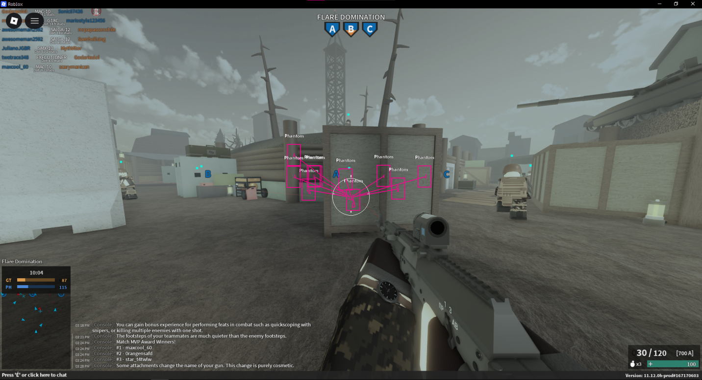

# Phantom Forces External



An external cheat framework for Phantom Forces on Roblox, featuring ESP (Box, Skeleton, Tracers) and Aimbot with smoothing and FOV checks.

## Features

- **Aimbot**
  - Smooth Aiming
  - FOV Circle & Check
  - Head/Body switching (Head Offset)
  - Keybind selection

- **ESP (Visuals)**
  - Box ESP
  - Skeleton ESP
  - Tracer Lines
  - Name Tags
  - Team Checks (Phantom/Ghost)
  - Customizable Colors & Thickness
  - Rainbow Mode

## Installation

1. Install Python 3.x
2. Install dependencies:
   ```bash
   pip install -r requirements.txt
   ```

## Usage

1. Open **Roblox** and join **Phantom Forces**.
2. Run the script:
   ```bash
   python phantom.py
   ```
3. Press **Shift + F** to toggle the menu.

## dont have python? check the releases for the exe version
